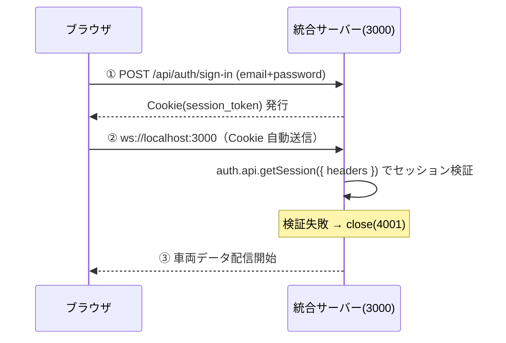

# リアルタイム車両位置表示アプリ 詳細仕様書

**作成日**: 2026-04-23  
**更新日**: 2026-04-29  
**目的**: Zustand / WebSocket / Leaflet / React Router / Code Splitting / BetterAuth の実践学習

---

## 1. 技術スタック

| 役割                      | 技術                         | バージョン                        |
| ------------------------- | ---------------------------- | --------------------------------- |
| フロントエンド            | React SPA                    | 19.x                              |
| ビルドツール              | Vite                         | 8.x                               |
| 言語                      | TypeScript                   | 6.x                               |
| 状態管理                  | Zustand                      | 5.x                               |
| ルーティング              | react-router-dom             | 7.x                               |
| 地図                      | Leaflet + react-leaflet      | leaflet 1.9.x / react-leaflet 5.x |
| スタイリング              | Tailwind CSS                 | 4.x                               |
| WebSocket（クライアント） | ブラウザ標準 `WebSocket` API | -                                 |
| WebSocket（サーバー）     | ws ライブラリ                | 8.x                               |
| サーバー実行              | tsx                          | 4.x                               |

---

## 2. ディレクトリ構成

```
vehicle-demo/
├── server/
│   ├── vehicle-server.ts        # 統合サーバー Hono + BetterAuth + WebSocket（port 3000）
│   ├── auth.ts                  # BetterAuth 設定（vehicle-server から参照）
│   └── db/
│       ├── index.ts             # Drizzle + NeonDB クライアント
│       └── schema.ts            # Drizzle スキーマ
├── src/
│   ├── pages/
│   │   ├── LandingPage.tsx      # トップページ
│   │   ├── VehiclesPage.tsx     # 車両表示ページ
│   │   ├── AboutPage.tsx        # 概要ページ
│   │   └── LoginPage.tsx        # ログイン
│   ├── store/
│   │   └── positionStore.ts     # Zustand store
│   ├── hooks/
│   │   ├── useVehicleWebSocket.ts
│   │   └── useAuth.ts           # セッション取得・ログアウト
│   ├── components/
│   │   ├── NavBar.tsx           # 全ページ共通ヘッダー（ユーザー名・ログアウト含む）
│   │   ├── AuthGuard.tsx        # 未認証なら /login へリダイレクト
│   │   ├── ConnectionStatusBar.tsx  # WS接続状態バー
│   │   ├── VehicleMap.tsx       # Leaflet地図
│   │   └── VehicleList.tsx      # 車両一覧パネル
│   ├── lib/
│   │   └── auth-client.ts       # better-auth/react クライアント
│   ├── constants/
│   │   └── vehicles.ts          # 車両カラー定数
│   ├── types/
│   │   └── vehicle.ts           # 共通型定義
│   └── App.tsx
├── package.json
├── tsconfig.json
└── vite.config.ts
```

---

## 3. 型定義（`src/types/vehicle.ts`）

```ts
export type VehiclePosition = {
  vehicleId: string; // "vehicle-01" | "vehicle-02" | "vehicle-03"
  lat: number;
  lng: number;
  timestamp: string; // ISO 8601形式 例: "2026-04-23T10:00:00.000Z"
};
```

---

## 4. 車両カラー定数（`src/constants/vehicles.ts`）

```ts
export const VEHICLE_COLORS: Record<string, string> = {
  "vehicle-01": "#2563EB", // 青
  "vehicle-02": "#DC2626", // 赤
  "vehicle-03": "#16A34A", // 緑
};
```

- `VehicleList` と `VehicleMap` の両方から参照する

---

## 5. 車両WebSocketサーバー仕様（`server/vehicle-server.ts`）

### 概要

- ポート: `3000`（Hono + BetterAuth + WebSocket を統合）
- プロトコル: WebSocket
- 実行コマンド: `npx tsx server/vehicle-server.ts`

### 管理車両

| vehicleId  | 初期緯度 | 初期経度 |
| ---------- | -------- | -------- |
| vehicle-01 | 35.1815  | 136.9066 |
| vehicle-02 | 35.1700  | 136.9150 |
| vehicle-03 | 35.1950  | 136.8950 |

（名古屋市周辺）

### 送信ロジック

- 各車両を独立した `setInterval` で管理し、送信タイミングをずらす

| vehicleId  | 送信間隔    | 開始遅延        |
| ---------- | ----------- | --------------- |
| vehicle-01 | 1000ms ごと | 0ms（即時開始） |
| vehicle-02 | 1000ms ごと | 333ms 後に開始  |
| vehicle-03 | 1000ms ごと | 666ms 後に開始  |

- 各車両の座標は毎回 `±0.0005` の範囲でランダム変化（疑似移動）
- 実装: `setTimeout` で遅延させてから `setInterval` を開始する

### 送信データ形式

```json
{
  "vehicleId": "vehicle-01",
  "lat": 35.1817,
  "lng": 136.9063,
  "timestamp": "2026-04-24T01:00:01.000Z"
}
```

### クライアント接続

- 複数クライアント同時接続に対応（`wss.clients` でブロードキャスト）
- 接続・切断のログを `console.log` で出力
- 接続時にブラウザが自動送信する Cookie を `auth.api.getSession({ headers })` で直接検証する（詳細は §13-6）
  - 検証失敗時は `close(4001, "Unauthorized")`
  - 検証成功後はブロードキャスト対象に含める

---

## 6. Zustand Store仕様（`src/store/positionStore.ts`）

```ts
type PositionStore = {
  positions: Map<string, VehiclePosition>; // key: vehicleId
  setPosition: (pos: VehiclePosition) => void;
};
```

- `setPosition` は `positions` の `Map` をコピーして `vehicleId` をキーに upsert し、新しい参照を返す
- 新しい参照を返すことで、購読コンポーネントの再レンダリングがトリガーされる
- 初期値: `positions = new Map()`

---

## 7. WebSocket接続フック仕様（`src/hooks/useVehicleWebSocket.ts`）

```ts
export type WsStatus = "connecting" | "connected" | "reconnecting" | "failed";

export function useVehicleWebSocket(): {
  status: WsStatus;
  nextRetryIn: number;
};
```

### 環境変数

| 変数名                 | 内容                       | デフォルト値          |
| ---------------------- | -------------------------- | --------------------- |
| `VITE_WS_URL`          | WebSocket接続先URL         | `ws://localhost:3000` |
| `VITE_WS_MAX_TOTAL_MS` | 再接続を試みる最大累計時間 | `30000`（30秒）       |

### 通常動作

- `useEffect` 内で `new WebSocket(VITE_WS_URL)` を確立
- `onopen`: `retryCount` をリセットし `status` を `connected` にする
- `onmessage`: `JSON.parse(event.data)` → `VehiclePosition` にキャスト → `setPosition` を呼ぶ
- `onerror`: `console.error(error)` を出力
- アンマウント時: `shouldReconnect` フラグを `false` にして `ws.close()`、タイマーをすべてキャンセル
- 依存配列: `[updateVehicle]`

### 再接続ロジック

| 設定項目         | 値                                           |
| ---------------- | -------------------------------------------- |
| 再接続戦略       | Exponential backoff（`BASE_DELAY * 2^n` ms） |
| `BASE_DELAY`     | 1000ms（固定値、コード定数）                 |
| 上限             | 初回切断から累計 `VITE_WS_MAX_TOTAL_MS` 以内 |
| 上限到達時の動作 | `status` を `failed` にして再試行停止        |

**タイムライン例（MAX_TOTAL_MS=30秒の場合）**

```
t=0   切断
t=1   1回目 再接続試行（+1秒後）
t=3   2回目 再接続試行（+2秒後）
t=7   3回目 再接続試行（+4秒後）
t=15  4回目 再接続試行（+8秒後）
t=30  → failed（次の+16秒待つと累計30秒超のため打ち切り）
```

**実装ポイント**

- `shouldReconnect` フラグでアンマウントによる意図的な `ws.close()` と、サーバー起因の切断を区別する
- `onopen` より前に `onclose` が発火するケース（サーバー不在）があるため、`shouldReconnect = true` は `connect()` 呼び出し前にセットする
- `onclose` 時に `elapsed + nextDelay > MAX_TOTAL_MS` なら即 `failed`
- カウントダウン表示用に `setInterval` で `nextRetryIn` を1秒ずつ減算する（`prev` を使う関数形式でクロージャの値キャプチャ問題を回避）

---

## 8. ルーティング仕様

### ルート定義

| パス        | コンポーネント | 説明                                         |
| ----------- | -------------- | -------------------------------------------- |
| `/`         | `LandingPage`  | 学習用デモであることを示すランディングページ |
| `/vehicles` | `VehiclesPage` | リアルタイム車両表示                         |
| `/about`    | `AboutPage`    | このデモの概要・技術スタック説明             |
| その他      | `<Navigate>`   | `/` へリダイレクト                           |

### コード分割

- `LandingPage` / `AboutPage` は eager import（軽量なため分割対象外）
- `VehiclesPage` のみ `React.lazy` で遅延ロード
  - Leaflet / react-leaflet など重いライブラリを含むため、初回バンドルから除外する効果が大きい
  - `/vehicles` への初回遷移時にチャンクをフェッチ、再遷移時はキャッシュ済みのため再フェッチなし

---

## 9. コンポーネント仕様

### 9-1. App.tsx

ルーティング定義のみを担う。WebSocket 接続は持たない。

- `/login` を除き、認証必須ページは `<AuthGuard>` でラップする
- `LoginRoute` はログイン済みユーザーを `/` へリダイレクトする補助コンポーネント

```tsx
// VehiclesPage のみ遅延ロード
const VehiclesPage = lazy(() => import("./pages/VehiclesPage"));

function LoginRoute() {
  const { user, isPending } = useAuth();
  if (isPending) return <Loading />;
  if (user) return <Navigate to="/" replace />;
  return <LoginPage />;
}

<BrowserRouter>
  <div className="flex flex-col h-screen">
    <NavBar />
    <div className="flex-1 overflow-y-auto">
      <Suspense fallback={<Loading />}>
        <Routes>
          <Route path="/login" element={<LoginRoute />} />
          <Route
            path="/"
            element={
              <AuthGuard>
                <LandingPage />
              </AuthGuard>
            }
          />
          <Route
            path="/vehicles"
            element={
              <AuthGuard>
                <VehiclesPage />
              </AuthGuard>
            }
          />
          <Route
            path="/about"
            element={
              <AuthGuard>
                <AboutPage />
              </AuthGuard>
            }
          />
          <Route path="*" element={<Navigate to="/" replace />} />
        </Routes>
      </Suspense>
    </div>
  </div>
</BrowserRouter>;
```

- `<Suspense>` は `<Routes>` 全体を包む
- フォールバックは `/vehicles` への初回遷移時のみ表示される

### 9-2. NavBar.tsx

- 全ページ共通で最上段に表示
- リンク: `ホーム` / `車両表示` / `About`
- `<NavLink>` を使用し、現在ページのリンクをアクティブスタイルで強調
  - アクティブ: 下線 + 文字色変化

### 9-3. LandingPage.tsx

- 「学習用デモ」と明示するシンプルなヒーローセクション
- 表示内容: タイトル / サブタイトル（使用技術の列挙） / 「車両表示を見る」ボタン（`/vehicles` へ遷移）

### 9-4. AboutPage.tsx

- このプロジェクトの学習目的・技術スタックを簡潔に説明するページ
- 表示内容: 目的の説明 / 技術スタック一覧（Zustand / WebSocket / Leaflet / React Router）

### 9-5. VehiclesPage.tsx

- `useVehicleWebSocket()` をマウント時に1回呼び、`status` / `nextRetryIn` を受け取る
- `/vehicles` に遷移したときだけ WebSocket 接続が確立される
- `/vehicles` から離脱（アンマウント）すると接続がクリーンアップされ、再接続タイマーも停止する

```
┌──────────────────┬───────────────────────────────────┐
│  ConnectionStatusBar（固定）                          │
│  ─────────────── │                                   │
│  VehicleList     │  VehicleMap                       │
│  （スクロール）   │  （右：地図）                      │
│  幅: w-70（280px）│  幅: 残り全部（flex-1）            │
└──────────────────┴───────────────────────────────────┘
```

- 外側: `flex flex-col h-full`
- 内側コンテンツ: `flex flex-1 overflow-hidden`
- 左パネル (`<aside>`): `flex flex-col w-70 shrink-0 border-r`
  - `ConnectionStatusBar`: 固定（スクロールしない）
  - 車両一覧ラッパー: `overflow-y-auto flex-1`（VehicleList のみスクロール）
- 右エリア (`<main>`): `flex-1`

### 9-6. ConnectionStatusBar.tsx

- **常時表示・固定高さ**（null を返さない）
  - 表示/非表示の切り替えをなくすことで、車両一覧・地図エリアのガタつきを防止する
- 左端にステータスドット（●）を表示し、右にメッセージを並べる
- **`failed` になるまでは緑で統一する**
  - `connecting` / `reconnecting` 中も緑のまま（最大30秒の誤差は許容）
  - ユーザーに関係のある情報は「完全に繋がらない」になった時だけ

| status                                      | 背景色     | ドット色 | 表示メッセージ                                   |
| ------------------------------------------- | ---------- | -------- | ------------------------------------------------ |
| `connected` / `connecting` / `reconnecting` | 薄グリーン | 緑       | 接続中                                           |
| `failed`                                    | 薄赤       | 赤       | 接続できません。ページを再読み込みしてください。 |

- Props は `status: WsStatus` のみ（`nextRetryIn` は不要）

### 9-7. VehicleList.tsx

Zustand の `positions` を `Array.from` で配列化して表示。

**表示項目（1車両ごと）**:

| 項目         | 内容                                                       |
| ------------ | ---------------------------------------------------------- |
| 車両番号     | `vehicleId`（例: `vehicle-01`）                            |
| 緯度         | `lat`（小数点6桁表示）                                     |
| 経度         | `lng`（小数点6桁表示）                                     |
| 最終同期時刻 | `timestamp` をローカル時刻にフォーマット（例: `10:00:01`） |

- データが来るたびにリアルタイムで再描画
- 車両は `vehicleId` の昇順でソートして表示
- `VEHICLE_COLORS` を参照し、車両ごとに色分けしたカードで表示
  - カード左ボーダー: 車両色
  - カード背景: 車両色 + 透明度（`color + "18"`）
  - 車両ID文字色: 車両色

### 9-8. VehicleMap.tsx

- `react-leaflet` の `MapContainer` / `TileLayer` / `Marker` / `Popup` を使用
- タイルレイヤー: OpenStreetMap（`https://{s}.tile.openstreetmap.org/{z}/{x}/{y}.png`）
- 初期表示: 緯度 `35.1815` / 経度 `136.9066` / ズーム `13`（名古屋市周辺）
- Zustand の `positions` を参照し、全車両分の `Marker` を描画
- `Marker` の `Popup` には `vehicleId` を表示
- `position` が空（Map サイズ 0）の場合はマーカーなし（地図は表示）

**マーカーアイコン**:

Leaflet のデフォルトアイコン（`marker-icon.png`）は使用しない。  
`L.divIcon` + インライン SVG で車両色のカスタムピンを生成する。

```ts
function createColoredIcon(color: string): L.DivIcon {
  const svg = `<svg ...><path fill="${color}" .../><circle .../></svg>`;
  return L.divIcon({
    html: svg,
    className: "",
    iconSize: [25, 41],
    iconAnchor: [12, 41],
    popupAnchor: [0, -41],
  });
}
```

- `VEHICLE_COLORS` から車両色を取得し、未定義の場合は `#6B7280`（グレー）をフォールバックとして使用
- この方式により、Vite バンドル時の Leaflet デフォルトアイコンパス欠損問題を根本回避している

---

## 10. package.json スクリプト

```json
{
  "scripts": {
    "dev": "vite",
    "server": "tsx --env-file=.env server/vehicle-server.ts",
    "build": "tsc && vite build",
    "preview": "vite preview"
  }
}
```

---

## 10-1. VSCode 開発環境起動（F5）

**F5 キー 1発で2サーバーを並列起動する。**

### 構成ファイル

| ファイル              | 役割                                             |
| --------------------- | ------------------------------------------------ |
| `.vscode/launch.json` | F5 の起動設定（Chrome デバッグ + preLaunchTask） |
| `.vscode/tasks.json`  | 起動タスクの定義                                 |

### launch.json

```json
{
  "version": "0.2.0",
  "configurations": [
    {
      "name": "Vehicle Demo",
      "type": "chrome",
      "request": "launch",
      "url": "http://localhost:5173",
      "preLaunchTask": "dev:all"
    }
  ]
}
```

### tasks.json — タスク実行フロー

```
F5
└─ dev:all（sequence）
     ├─ 1. kill-ports    ポート 3000 / 5173 を強制解放
     └─ 2. start-servers（parallel）
           ├─ vehicle-server    npm run server（port 3000）
           └─ vite-dev          npm run dev（port 5173）
```

**kill-ports タスクを先行させる理由:**  
F5 を再押下するたびに前のプロセスが残り `EADDRINUSE` でサーバーが起動失敗する。  
`fuser -k` で既存プロセスを強制終了してから起動することで、何度でも F5 で再起動できる。

---

## 11. 動作確認の定義（完了条件）

| 確認項目         | 期待する動作                                                   |
| ---------------- | -------------------------------------------------------------- |
| ルーティング     | `/` / `/vehicles` / `/about` それぞれのページが表示される      |
| 不正URL          | 未定義パスは `/` へリダイレクトされる                          |
| ナビゲーション   | NavBar の現在ページリンクがアクティブスタイルで強調される      |
| コード分割       | 初回ロード時 Network タブに VehiclesPage チャンクが含まれない  |
| 遅延ロード       | `/vehicles` 初回遷移時に VehiclesPage チャンクがフェッチされる |
| WebSocket 接続   | `/vehicles` 遷移時に WebSocket が接続される                    |
| WebSocket 切断   | `/vehicles` から離脱すると WebSocket が切断される              |
| 再接続           | サーバー停止後、Exponential backoff で再接続を試みる           |
| 再接続UI         | 再接続中もステータスバーはグリーン（接続中）のまま変化しない   |
| 再接続UI（赤）   | 累計30秒経過後にステータスバーが赤になり、再試行が停止する     |
| 再接続成功       | サーバー再起動後に接続が回復し、ステータスバーはグリーンのまま |
| ガタつきなし     | 接続状態が変化しても車両一覧・地図エリアの高さが変わらない     |
| 地図表示         | OpenStreetMap タイルが表示される                               |
| マーカー表示     | 3台分のカラーピンが地図上に表示される                          |
| リアルタイム移動 | 1秒ごとにマーカー位置が更新される                              |
| 車両一覧         | 左パネルに3台の座標・同期時刻がリアルタイムで更新される        |
| 色分け           | 車両ごとにピン色とリストカード色が一致している                 |

---

## 12. スコープ外（今回実装しない）

- エラー画面
- 車両の走行履歴（軌跡）表示
- テスト

---

## 13. 認証・認可仕様（追加フェーズ）

### 13-1. 構成概要

| サーバー                       | ポート | 役割                                                |
| ------------------------------ | ------ | --------------------------------------------------- |
| React SPA (Vite)               | 5173   | フロントエンド                                      |
| 統合サーバー (Hono + BetterAuth) | 3000   | 認証（BetterAuth）+ 車両位置配信（WebSocket）統合 |

### 13-2. 技術スタック（追加分）

| 役割                       | 技術                           |
| -------------------------- | ------------------------------ |
| 認証ライブラリ             | better-auth                    |
| 認証サーバーフレームワーク | Hono                           |
| ORM                        | Drizzle ORM                    |
| DB                         | NeonDB (Serverless PostgreSQL) |
| DB ドライバー              | @neondatabase/serverless       |

### 13-3. ロール定義

| ロール  | 説明         |
| ------- | ------------ |
| `admin` | 管理者       |
| `user`  | 一般ユーザー |

- ロールによる機能制限なし
- NavBar にログインユーザー名とロールを表示

### 13-4. ディレクトリ構成（追加分）

```
server/
├── auth.ts              # BetterAuth 設定（vehicle-server から参照）
├── vehicle-server.ts    # 統合サーバー Hono + BetterAuth + WebSocket（port 3000）
└── db/
    ├── index.ts         # Drizzle + NeonDB クライアント
    └── schema.ts        # Drizzle スキーマ（NeonDB の既存テーブルに合わせる）

src/
├── pages/
│   ├── LoginPage.tsx              # 新規追加（認証不要な唯一のページ）
│   ├── LandingPage.tsx
│   ├── VehiclesPage.tsx
│   └── AboutPage.tsx
├── hooks/
│   ├── useAuth.ts                 # セッション取得・ログアウト
│   └── useVehicleWebSocket.ts     # Cookie 自動送信で WS 接続
├── lib/
│   └── auth-client.ts             # better-auth/react クライアント（authClient）
└── components/
    ├── AuthGuard.tsx              # 未認証なら /login へリダイレクト
    └── NavBar.tsx                 # ユーザー名・ロール・ログアウトボタン追加
```

### 13-5. 認証フロー

#### ログイン

```
① ユーザーが /login でメール + パスワードを入力
② POST /api/auth/sign-in/email → vehicle-server (BetterAuth)
③ Cookie (better-auth.session_token) を発行
④ React SPA が GET /api/auth/get-session → ユーザー情報取得
⑤ 全ページ表示（NavBar にユーザー名・ロール表示）
```

#### 未認証アクセス

```
① 起動時 GET /api/auth/get-session → 401 or null
② /login にリダイレクト
```

#### ログアウト

```
① NavBar の [ログアウト] クリック
② POST /api/auth/sign-out → Cookie 削除
③ /login にリダイレクト
```

### 13-6. WS 接続の認証（Cookie 直接検証方式）

vehicle-server と認証機能が同一サーバー（port 3000）に統合されているため、
WS 接続時にブラウザが自動送信する Cookie をサーバー内で直接検証できる。
クエリパラメーターへのトークン付与やサーバー間通信は不要。

```
ws://localhost:3000
```

**認証フロー:**

```
① React SPA が new WebSocket("ws://localhost:3000") を確立
   - ブラウザは同一オリジンの Cookie (better-auth.session_token) を自動送信
② vehicle-server が WS ハンドシェイク時に auth.api.getSession({ headers }) を呼び出す
③ 検証失敗 → WS 接続を即時クローズ（コード 4001）
④ 検証成功 → 通常通り車両位置データを配信
```

**認証フロー図:**



> **設計意図:**
>
> - HttpOnly Cookie を JS から触らせない → XSS 耐性
> - 認証と配信が同一サーバーのため、サーバー間通信・共有シークレット不要
> - 接続ごとに Cookie を検証するため、セッション失効時は次の接続で即遮断

### 13-7. BetterAuth 設定（auth.ts）

```ts
export const auth = betterAuth({
  // ブルートフォース対策（学習用は memory、実運用は database / Redis 推奨）
  rateLimit: {
    storage: "memory",
    customRules: {
      "/sign-in/email": { window: 60, max: 5 }, // 60秒間に5回まで
    },
  },
  // Drizzle で NeonDB へ接続。schema を渡すことで型情報が活きる
  database: drizzleAdapter(db, { provider: "pg", schema }),
  emailAndPassword: { enabled: true },
  session: {
    expiresIn: 60 * 60 * 24 * 7, // 7日間
    updateAge: 60 * 60 * 24, // 1日ごとに有効期限を更新
  },
  plugins: [admin()],
  trustedOrigins: [process.env.AUTH_CORS_ORIGIN!],
});
```

### 13-8. CORS 設定（vehicle-server.ts）

```ts
// /api/auth/* のみ CORS を許可
app.use(
  "/api/auth/*",
  cors({ origin: process.env.AUTH_CORS_ORIGIN!, credentials: true }),
);
```

### 13-9. ルーティング変更（React SPA）

| パス        | コンポーネント | 認証要否 |
| ----------- | -------------- | -------- |
| `/login`    | `LoginPage`    | 不要     |
| `/`         | `LandingPage`  | 必要     |
| `/vehicles` | `VehiclesPage` | 必要     |
| `/about`    | `AboutPage`    | 必要     |
| その他      | `<Navigate>`   | -        |

- 認証チェックは `useAuth` フックで行い、未認証なら `/login` へリダイレクト
- ログイン済みで `/login` にアクセスした場合は `/` へリダイレクト

### 13-10. NavBar 変更

```
[ホーム] [車両表示] [About]          {name} ({role}) [ログアウト]
```

- `useAuth` から `user.name` と `user.role` を取得して表示
- [ログアウト] クリックで `signOut()` → `/login` にリダイレクト

### 13-11. 初期データ

- 別アプリで作成済みの NeonDB を再利用
- サインアップページは実装しない
- `/login`（メール + パスワード）のみ

### 13-12. 環境変数（追加分）

| 変数名               | 内容                                                   | 利用側              |
| -------------------- | ------------------------------------------------------ | ------------------- |
| `DATABASE_URL`       | NeonDB 接続文字列                                      | server/db           |
| `BETTER_AUTH_SECRET` | セッション署名用シークレット                           | server/auth.ts      |
| `BETTER_AUTH_URL`    | サーバーの公開URL（BetterAuth 内部参照）               | server 共通         |
| `AUTH_SERVER_PORT`   | サーバー Listen ポート（既定 3000）                    | vehicle-server.ts   |
| `AUTH_CORS_ORIGIN`   | CORS 許可オリジン（Vite dev: `http://localhost:5173`） | vehicle-server.ts / auth.ts |
| `VITE_AUTH_API_URL`  | フロントから叩く認証 API の URL                        | Vite ビルド時注入   |
| `VITE_WS_URL`        | フロントの WebSocket 接続先 URL                        | Vite ビルド時注入   |
| `VITE_WS_MAX_TOTAL_MS` | 再接続を試みる最大累計時間（既定 30000）             | Vite ビルド時注入   |

### 13-13. React SPA 認証のセキュリティ上の注意事項

#### JS バンドルは全員に配信される

React SPA はアクセス時に全ページのコードを含む JS バンドルをブラウザへ返す。  
`AuthGuard` はあくまで**表示を隠すだけ**であり、コードの配信を止めることはできない。

```
GET /  →  index.html + JS バンドル（全ページのコードが含まれる）← 認証不要で誰でも取得可能
```

|                                               | 守れるか                       |
| --------------------------------------------- | ------------------------------ |
| ページの存在（`/admin` というルートがある等） | ❌ バンドルから読める          |
| UI の構造・コンポーネントのコード             | ❌ バンドルから読める          |
| 車両位置データ（WS）                          | ✅ WSサーバーが token 検証     |
| ユーザー情報（API）                           | ✅ 認証サーバーが session 検証 |

#### 大前提：データを守る責務はすべてサーバー側にある

「コードは公開情報、データは非公開情報」という割り切りが React SPA の前提。  
フロントの認証チェックはあくまで UX のためであり、セキュリティの本体ではない。

```
// NG: フロントで認証チェックして満足する
if (user.role === "admin") {
  // 機密データをここで持つ ← コードごと公開されている
}

// OK: フロントは表示を隠すだけ、データはサーバーが守る
if (user.role === "admin") {
  // API を叩く → サーバーが role を再検証 → データを返す
}
```

#### このプロジェクトでの対応

車両位置データ（唯一の機密情報）は WS サーバーが token 検証するため、  
未認証クライアントはデータを取得できない。JS バンドルが見えても問題ない。

#### Next.js との違い

Next.js の Server Components はコードをサーバーで実行するため JS バンドルに含まれない。  
機密ロジックをクライアントに渡したくない場合は Next.js が適切。

---

### 13-14. 動作確認の定義（追加分）

| 確認項目              | 期待する動作                                        |
| --------------------- | --------------------------------------------------- |
| 未認証アクセス        | `/` アクセス時に `/login` へリダイレクト            |
| ログイン              | メール+パスワードでログイン → トップページへ遷移    |
| NavBar 表示           | ログイン後にユーザー名・ロールが表示される          |
| ログアウト            | [ログアウト] クリックで `/login` へリダイレクト     |
| ログイン済みで /login | `/` へリダイレクト                                  |
| WS 認証成功           | Cookie を持つ状態で WS 接続 → 車両データ受信        |
| WS 認証失敗（未認証） | Cookie なし（未ログイン）で WS 接続 → 即時クローズ（4001） |

---

### 13-15. 接続後の定期再認証

#### 課題

接続時のセッション検証のみでは、一度確立した WS 接続は BetterAuth セッションが
失効・ban されても車両データ（機密情報）を配信し続けてしまう。

#### 仕様

vehicle-server は接続中のクライアントに対して、定期的に `auth.api.getSession()` を
サーバー側で呼び出してセッションを再検証する。クライアント側の関与は不要。

| 項目       | 値   | 定数名              |
| ---------- | ---- | ------------------- |
| 再認証間隔 | 30秒 | `RENEW_INTERVAL_MS` |

#### サーバー側フロー

```
接続成功時（初回検証で取得した headers を保持）:
  setInterval(RENEW_INTERVAL_MS):
    auth.api.getSession({ headers }) を呼び出す
    セッション無効 → ws.close(4401, "Session expired")
    セッション有効 → 配信継続
```

クライアントへの制御メッセージ送信・クライアントからの応答は不要。  
通常の車両データ配信のみ継続する。

#### 動作確認の追加項目

| 確認項目                         | 期待する動作                                                           |
| -------------------------------- | ---------------------------------------------------------------------- |
| 定期再認証成功                   | 30秒経過後も WS 接続が継続し、車両データが流れ続ける                   |
| 定期再認証失敗（セッション失効） | サーバー側で session を削除すると次の再認証タイミング（約30秒後）で 4401 切断 |
